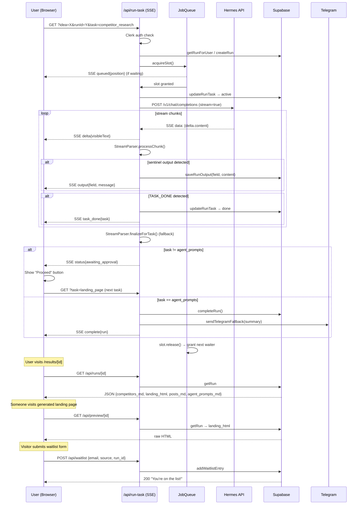

# StartupForge — CLAUDE.md

## What this is

Next.js 14 dashboard: user submits product idea → agent runs 4 sequential tasks → outputs competitor research, landing page HTML, launch posts, AI agent prompts. Each task streams live via SSE.

## Stack

| Layer | Tech |
|-------|------|
| Framework | Next.js 14 App Router, TypeScript |
| Auth | Clerk (`@clerk/nextjs`) |
| DB | Supabase (Postgres via `@supabase/supabase-js`) |
| AI | Hermes Agent — OpenAI-compatible API at `HERMES_URL/v1/chat/completions` |
| Notifications | Telegram Bot API (optional) |
| Deploy | Docker + Coolify on DigitalOcean |

## Task pipeline

4 tasks run sequentially. Each requires user approval before the next starts:

```
competitor_research → landing_page → launch_posts → agent_prompts
```

Each task:
1. Client opens SSE connection to `/api/run-task?idea=...&runId=...&task=<name>`
2. Server acquires concurrency slot (max 10, in-process queue)
3. Builds prompt via `lib/hermes.ts` → `buildPromptForTask()`
4. Streams response from Hermes API
5. `StreamParser` accumulates text, extracts sentinel-wrapped outputs
6. Saves output field to Supabase, emits SSE events to client
7. On `task_done`: sends `awaiting_approval` status → client shows "Proceed" button
8. Final task (`agent_prompts`): marks run `complete`, sends Telegram summary

## Key files

```
lib/hermes.ts          — prompt builders + Hermes API client (runTask)
lib/parse-stream.ts    — SSE stream parser + StreamParser (sentinel extraction)
lib/supabase.ts        — all DB helpers (createRun, saveRunOutput, completeRun, etc.)
lib/job-queue.ts       — in-process concurrency gate (MAX_CONCURRENT=10)
lib/types.ts           — TaskName, Run, SseEvent types + constants
lib/telegram.ts        — sendTelegramFallback + extractTelegramSummary
lib/sse.ts             — formatSseEvent helper
app/api/run-task/      — main SSE handler (auth, queue, stream, persist)
app/api/waitlist/      — POST handler for generated landing page signups
app/api/preview/[id]/  — serves raw landing_html for a run
app/api/status/[id]/   — resume/poll run progress (SSE)
app/api/runs/[id]/     — fetch run JSON outputs
```

## Supabase tables

**`runs`**
- `id` (uuid), `user_id`, `idea`, `status` (running/complete/error)
- `tasks` (jsonb: `{competitor_research, landing_page, launch_posts, agent_prompts}` → pending/active/done)
- `competitors_md`, `landing_html`, `posts_md`, `agent_prompts_md` (text outputs)
- `error_message`, `created_at`, `completed_at`

**`waitlist`**
- `id`, `email` (unique), `source`, `run_id`, `created_at`

## Sentinel protocol

Hermes wraps each output in named sentinels:

```
===COMPETITORS===
...markdown...
===COMPETITORS===
TASK_DONE: competitor_research
```

`StreamParser` scans accumulated buffer for sentinel pairs → extracts content → emits `output` SSE event with `field` + `message`. Falls back to full accumulated text if no sentinels detected and output is >200 non-whitespace chars.

## SSE event types

| Type | Payload | Meaning |
|------|---------|---------|
| `status` | `message`, `task` | Progress update / heartbeat |
| `delta` | `content`, `task` | Streaming text chunk (display only) |
| `output` | `field`, `message` | Persisted task output ready |
| `task_done` | `task` | Task marked done in DB |
| `queued` | `position`, `task` | Waiting for concurrency slot |
| `complete` | `run` | Full run finished |
| `error` | `message` | Task failed |

## Environment variables

```
NEXT_PUBLIC_CLERK_PUBLISHABLE_KEY
CLERK_SECRET_KEY
HERMES_URL                   # e.g. http://hermes-agent:8642
HERMES_API_KEY               # API_SERVER_KEY from Hermes
NEXT_PUBLIC_APP_URL          # public domain — used in landing page form action
SUPABASE_URL
SUPABASE_SERVICE_KEY
TELEGRAM_BOT_TOKEN           # optional
TELEGRAM_CHAT_ID             # optional
DAILY_RUN_LIMIT              # default 1
ENFORCE_DAILY_LIMIT          # set "true" to enforce
MONTHLY_RUN_LIMIT            # default 5
ENFORCE_MONTHLY_LIMIT        # set "true" to enforce
STREAM_DEBUG                 # set "1" to log raw SSE payloads
```

## Protocol flow diagram



## Adding a new task

1. Add name to `TaskName` union in `lib/types.ts`
2. Add sentinel to `SENTINELS` in `lib/hermes.ts`
3. Write `buildXxxPrompt()` in `lib/hermes.ts`
4. Add case to `buildPromptForTask()` switch
5. Add field to `OutputField`, `TASK_TO_FIELD`, `DEFAULT_TASKS`, `TASK_LABELS`, `PROCEED_LABELS`
6. Update `SENTINEL_ORDER` in `lib/parse-stream.ts`
7. `isLastTask` check in `run-task/route.ts` uses `task === 'agent_prompts'` — update if new task is last

## Job queue notes

`lib/job-queue.ts` is **in-process only** — state lost on restart, not shared across replicas. Single-container deploy only. For horizontal scale: replace with Redis or Supabase counter.

## Hermes API

OpenAI-compatible. Headers: `Authorization: Bearer <HERMES_API_KEY>`, `X-Hermes-Session-Id: <runId>`. Model name: `hermes-agent`. Supports `stream: true`. Has web search capability (used in competitor research prompt).
